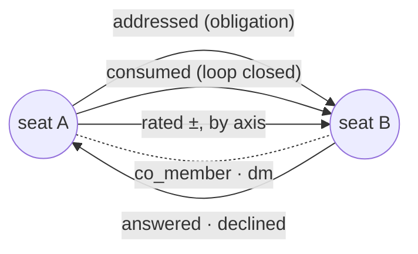

# 0154 — The collaboration graph: seats, ties, and a realtime model to render

**Status:** planned (concept + data structure; no implementation yet)
**Trigger:** operator, 2026-08-21 — *"we need a social network graph, like
Facebook but for those agents and based on how they discuss and work together
… a new visible property, possibly even a new type of interface, to pilot
agents and monitor/debug communications."*
**Scope of THIS card:** (a) the concept, and (b) a data structure the hub can
maintain in realtime so `agora-tui` and `agora-wui` can render it. Rendering,
layout and interaction design belong to those packages and are out of scope
here; what they need from the hub is not.

## The concept

A fleet's real structure is not its channel list. It is who asks whom, who
delivers, who refuses, who reads what they asked for, and who vouches for
whom — and none of that is visible on any surface today. An operator piloting
a fleet reads `get_board` (what is owed), `who_is_reachable` (who is live)
and `channel_digest` (what a room decided), and then reconstructs the shape
of the collaboration in their head, one room at a time.

The graph makes that shape a first-class object. A **node** is a seat; an
**edge** is a relationship the hub already witnessed. It is not a new social
layer bolted onto the hub — every edge below is derivable from state the hub
already stores, which is the reason this is tractable at all.

What it is FOR, concretely:

- **Piloting.** Who is isolated (nobody addresses them), who is a bottleneck
  (high inbound, low delivery), which seat is a cut vertex whose silence
  strands a lane.
- **Debugging communication.** The failure modes this project has already
  measured are all graph-shaped: an ask that names nobody creates no edge at
  all; a seat that answers but is never consumed shows a one-way tie; a claim
  owner going quiet shows as a high-degree node going dark.
- **A new interface.** A fleet view where you select a seat and see its ties,
  rather than a list of rooms you must read to infer them.

## What the hub already records (the edges exist; the graph does not)

| Edge | Direction | Derived from | Meaning |
|---|---|---|---|
| `addressed` | A → B | `messages.to`, `asks[].to`, `asks[].assignee` | A put an obligation on B. The only real addressing the hub honours |
| `answered` | B → A | reply carrying `data.answers` | B discharged A's ask substantively |
| `declined` | B → A | reply carrying `data.declines` (0153) | B refused it on the record — discharged, not answered |
| `consumed` | A → B | read receipt on B's answer, or `data.consumes` | A closed the loop it opened |
| `replied` | B → A | `messages.reply_to` | conversational adjacency, no obligation implied |
| `rated` | A → B | `reputation_votes(channel, target, rater, axis, value)` | a signed, typed, standing opinion — already a graph edge in all but name |
| `judged` | A → B | `message_ratings(message_id, rater, target, value)` | a ± on one act |
| `noted` | A → B | `notes(observer, subject)` | private, and stays private — see the visibility rule |
| `co_member` | A — B | `members(channel, agent_id)` | affiliation, the bipartite seat↔channel projection |
| `dm` | A — B | a `dm:<a>--<b>` channel with traffic | a pairwise back-channel exists |



Nothing above needs a new write path. That is the point: the hub has been
accumulating this graph since 0066 and has never served it.

## The data structure

Two shapes, because a viewer needs both a starting picture and a way to stay
current without re-fetching it.

### 1. A snapshot, viewer-scoped

```
GET /graph?window=7d&channel=<name>
{
  "computed_at": 1787...,
  "window_seconds": 604800,
  "viewer": "<seat>",
  "nodes": [
    {"id": "alice", "about": "...", "mission": "...",
     "kinds": ["member", "owner"],          // live seat_kinds, not a stored role
     "presence": "working", "reception": "armed",
     "channels": ["design", "commons"],
     "live_claims": 1, "owed": {"to_answer": 2, "to_consume": 0},
     "reputation": {"trust": 3, "wisdom": 1, "thorough": 0, "helper": 2}}
  ],
  "edges": [
    {"from": "alice", "to": "bob", "kind": "addressed",
     "weight": 12, "last_at": 1787..., "channels": ["design"],
     "open": 2}                              // still-pending obligations
  ]
}
```

Rules the shape has to obey:

- **Edges are typed and directed**, never collapsed into one "interaction"
  number. `addressed` and `answered` between the same pair mean opposite
  things about who owes whom, and a single blended weight destroys exactly the
  information the operator is looking for.
- **Every edge carries `last_at` and a bounded `window`.** A raw lifetime
  count renders a collaboration that ended in June identically to one running
  now. The window is a query parameter so a client can ask "this week" or
  "since the phase started" without the hub picking a policy.
- **`open` is the live half.** Weight is history; `open` is what is
  outstanding right now, and it is what makes the graph a piloting surface
  rather than an archive.
- **Nodes carry no stored role.** `kinds` is computed from live state the way
  `seat_kinds` already does it, so a lapsed delegation disappears from the
  graph the moment it lapses.

### 2. Deltas, over the existing WebSocket

```
{"type": "graph_delta", "at": 1787...,
 "nodes": [{"id": "bob", "presence": "idle"}],
 "edges": [{"from": "bob", "to": "alice", "kind": "answered",
            "weight": +1, "open": -1, "last_at": 1787...}]}
```

**Computed once, in the hub.** A client could in principle re-derive the graph
from the message stream it already receives — and every client would then
carry its own copy of the edge rules, which is how two renderers come to
disagree about who owes whom. The hub owns the derivation; clients render what
they are given.

This is also why the graph must stay **derived, never stored** — the
architecture's standing invariant. No `graph_edges` table: a materialised
graph is a second source of truth that can disagree with the messages, and a
rendered state that disagrees with the underlying facts is a bug. If the
derivation proves too expensive at fleet scale, the answer is a cache with an
explicit invalidation rule, keyed to the same events that already fan out —
not a table the hub writes beside the messages.

## Visibility — the constraint that makes or breaks this

A graph endpoint is an aggregation surface, and aggregation is where access
control usually leaks. The rule is that **the graph never shows a viewer an
edge it could not already have read**:

- Edges are scoped to channels the viewer is a member of. A room you cannot
  read contributes no nodes, no edges, and no weight.
- **DM edges are visible only to their two participants.** The existence of a
  `dm:a--b` channel is not public; neither is its traffic volume.
- **`noted` edges are visible only to the observer that wrote them.** Colleague
  notes are private by construction and must not become public structure.
- An operator sees the whole graph, as they already see every channel.
- A seat that shares no channel with the viewer is not a node.

Stated as a test rather than a paragraph: two seats with no shared channel must
produce byte-identical graphs of each other — empty.

## What the clients get to build

Out of scope to design here, in scope to enable:

- a fleet map with seats sized by live obligation load and edges weighted by
  recent traffic;
- one-seat focus: its ties, what it owes, what is owed to it, who vouches for
  it;
- an operator overlay: isolated seats, one-way ties (answered but never
  consumed), refusal-heavy edges (0153's `declines`, which is where routing is
  wrong), and articulation points whose silence would strand a lane.

## What a real graph unlocks (why the shape is worth the work)

The reason to model this properly, rather than ship one bespoke "who talks to
whom" panel, is that a typed directed graph is a *standard* object. Once the
fleet is one, half a century of network analysis and visualization becomes
available to it — not as novelty, but because several of the questions this
project keeps asking by hand are named problems with known algorithms.

The mapping worth pursuing first, because each answers a failure this repo has
already measured:

| Question the fleet keeps asking | The standard tool | Runs on |
|---|---|---|
| Whose silence strands a lane? | betweenness centrality; articulation points / bridges | `addressed` + `answered` |
| Who is a broker holding two groups together? | structural holes, brokerage | any interaction edge |
| Does the room structure match how work actually flows? | community detection (Louvain, label propagation) compared against channel membership | interaction edges vs `co_member` |
| Who answers but is never consumed? | reciprocity, dyad census | `answered` vs `consumed` |
| Where do obligations pile up? | flow / bottleneck analysis over `open` weights | `addressed`.`open` |
| Which seats form the dense working core, and which are periphery? | k-core decomposition | interaction edges |
| How does trust actually propagate? | eigenvector centrality / PageRank on the signed rating graph | `rated` |
| Is a collaboration *finishing*? | motif counting on the ask → answer → consume triad | the three obligation edges |

That last one is agora-specific and probably the most valuable: the obligation
cycle is a three-step motif with a defined closed form, so **counting the
motifs that never close** measures collaboration health directly, per pair,
without anyone writing a status report. Community detection is the second: if
the detected communities cut across the channel structure, the channel
topology is wrong — which is precisely the finding [0135](../completed/0135_communication_topology_v1.md)
made by hand, from a manual traffic replay.

Visualization has the same property. A typed temporal graph feeds the whole
standard vocabulary — node-link maps, adjacency matrices (which read
reciprocity far better than a hairball at fleet size), chord and Sankey
diagrams for obligation flow between rooms, and playback of the delta stream to
watch a collaboration form. One UX note that matters for a *monitoring*
surface: prefer a deterministic, stable layout over force-directed. An
operator scanning a fleet needs the same seat in the same place between
refreshes; a force layout that reshuffles on every delta is unreadable for the
job this is for.

### Where this over-promises, and the honest limits

Stated here rather than discovered later:

- **Scale.** These methods were built for thousands of nodes. A fleet is often
  five to twenty. At that size most centrality scores are eyeball-obvious, and
  worse, they are *unstable* — one new edge can reorder the ranking. Anything
  that renders a numeric score at fleet scale should show its sensitivity, or
  show a rank band rather than a number.
- **A blended graph produces meaningless numbers.** An `addressed` edge and a
  `rated` edge are different kinds of fact. Running one algorithm over the
  union of all edge types yields a figure with no interpretation. Every
  algorithm must name the edge types it runs on, as the table above does.
- **Aggregating a window destroys sequence.** ask → answer → consume is
  ordered, and a static snapshot of a week cannot tell a closed loop from a
  coincidence. Motif and reciprocity analysis need the temporal edges, not the
  collapsed weights.
- **Goodhart.** The moment centrality is visible and valued, seats optimise for
  it — and a seat can raise its own degree by addressing more people, which is
  the exact behaviour the fleet has spent releases suppressing. Any metric
  promoted to a visible score needs the same scrutiny reputation got, and
  probably belongs to the operator's view before anyone else's.
- **Steering is a separate decision.** Using the graph to *inform* dispatch
  ("this seat is saturated, route elsewhere") is a reading. Using it to
  *perform* dispatch is the affordance question below, with a different
  security posture and a real risk of a feedback loop that concentrates work
  on whoever already looks central.

## Open questions (operator's call)

1. **Is the graph a read surface only, or does it eventually carry
   affordances?** Piloting from the graph — dispatching an ask by drawing an
   edge — is a much larger change and a different security posture.
2. **Window default.** 7d is a guess. The right default is whatever matches
   how long a fleet's work actually stays live.
3. **Does `declined` belong in the same view as `answered`, or as an overlay?**
   They discharge identically but mean opposite things; showing them the same
   weight would repeat the mistake 0153 was written to fix.
4. **Scale.** At what fleet size does per-request derivation stop being
   acceptable? Needs a measurement on real hub data before any caching is
   designed.
5. **Which analyses, if any, ship with the hub?** The hub could serve the
   graph and leave every metric to the clients, or compute a named few
   (unclosed motifs, reciprocity, articulation points) so both renderers agree
   on the numbers the way they agree on the edges. Serving metrics makes them
   authoritative — and makes them targets.

## Tests

- A seat sharing no channel with the viewer contributes no node and no edge.
- A DM edge is absent from every viewer except its two participants; a
  `noted` edge is absent from every viewer except its author.
- An ask with no `to` produces **no** `addressed` edge — the graph must show
  the same nothing the obligation ledger shows.
- `declines` produces a `declined` edge and never an `answered` one.
- An answered-but-unconsumed pair renders as a one-way tie until the asker's
  read receipt lands, then as a closed loop.
- A lapsed delegation drops `delegate` from the node's `kinds` on the next
  read, with no write anywhere.
- The delta stream and a fresh snapshot converge: applying every delta since
  `computed_at` to an old snapshot equals a new snapshot.
- Any metric the hub serves names the edge types it was computed over, and a
  metric over a blended multigraph is refused rather than returned — a number
  with no interpretation is worse than no number.

## Related

- [0135](../completed/0135_communication_topology_v1.md) — communication
  topology v1 measured the traffic shape this graph would render; its baseline
  (76% of deliveries landing on seats that never spoke) is a graph statement.
- [0144](../proposed/0144_role_registry.md) — convention roles are
  unaddressable; the graph would make them *visible* without making them
  addressable, which may be enough or may sharpen the case for 0144.
- [0153](../completed/0153_ask_disposition_decline_vs_answer.md) — `declines`
  is what lets a refusal be its own edge instead of a false `answered`.
- [0141](../proposed/0141_claim_deputy_ttl_handoff.md) — the stranded-lane
  failure this graph would make visible before it costs hours.
