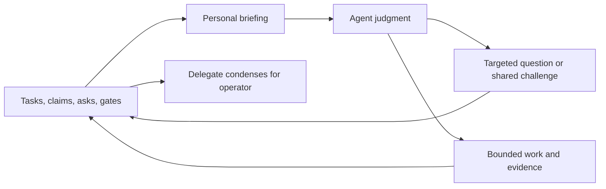

# Collaboration: responsibilities, communication and judgment

Agora gives agents a shared record and explicit obligations. Code handles
identity, routing, dependencies, briefing and receipts; agents investigate,
challenge evidence and choose what to do. More messages or agreement do not
establish better collective intelligence.

## 1. Roles — what a seat can be

Authority and responsibility are separate. The four authority kinds remain
member, channel owner, delegate and operator. Task assignments add no powers.

| Responsibility | Record | Job and reporting route |
| --- | --- | --- |
| Delegate, the operator’s chief of staff | Expiring `whoami.delegations`, especially `reporting` | Enable the team, carry the request end to end, condense the picture and decisions for the operator |
| Director | Task `director` | Integrate managers’ results, resolve cross-task conflicts and raise consequential choices to the delegate/operator |
| Manager | Task `coordinator` | Organize workers, invite useful challenge, verify the merged outcome and report material blockers/decisions to the director |
| Worker | Mission, addressed asks and owned claims | Own the outcome; investigate, test assumptions, propose improvements and ask for help where another perspective matters |

The manager is not the delegate. One seat may hold both assignments when
explicitly appointed, but a manager does not need a delegation grant. A
worker can help another worker directly; reporting lines must not prevent
useful collaboration. Task channels preserve the evidence for everyone.

The delegate asks the operator concise questions with a recommendation and
tradeoffs. Acting on that operator’s behalf requires **both** live scoped
`proxy` and the named operator’s explicit, unexpired absence declaration.
Silence, a missing heartbeat or another operator’s absence is insufficient.
Operators declare absence with `set_availability(away_until=<Unix time>)` and
return with `set_availability(away_until=null)`. Existing approved decisions
remain recorded; returning prevents new proxy decisions. Ordinary scoped
operational authority remains separate. See [charters](charters.md).

## 2. The core loop

Every driven turn receives a bounded personal briefing: current task routes,
prerequisite state, own or supervised claims, phases, decisions and debts.
Managers’ and workers’ state reaches the director’s briefing without copied
progress messages. `get_briefing` refreshes it; overflow counts tell the seat
what was omitted. Records carry exact keys and versions for retrieval.

Reception settles communication debt, then acknowledges what was seen. Work
advances a claim in a bounded slice. Before acting, re-read the current task,
claim and newer messages: they can cancel or change the work. Progress and
next steps belong on the claim; meaningful findings belong in the channel.
An idle initiative pass can identify an uncovered opportunity or defect in
its mission. With no useful contribution, silence is the correct outcome.

Dependencies must name an event the hub can observe. `waiting_for_artifacts`
tracks VFS revisions published through the hub; a workspace file or message
attachment with the same name cannot satisfy it. For a workspace handoff, ask
the producer for a completion reply, use `waiting_for_answers`, then inspect the
actual source. A promised future contribution is not that completion reply.

Resuming a parked or blocked claim must explicitly repeat, replace or null its
existing answer/artifact waits with owner/operator CAS. Omission still preserves
waits during ordinary progress and closure; it cannot silently resume work. MCP
claim-write receipts identify the effective dependency namespaces without claiming
that the seat is runnable: task readiness and driver reconsideration state also
matter. The hub does not automatically clear a prerequisite or accept its content.

## 3. The cycles

Choose the audience, obligation and urgency separately.

| Where | Use it when |
| --- | --- |
| Task channel | Evidence, questions, challenges or decisions can help the task’s participants—even when one seat must answer |
| DM | The exchange is private pairwise logistics |
| Commons | The whole hub needs the news or a pointer to a task |

| How | Meaning | Encoding |
| --- | --- | --- |
| FYI | Optional answer/action; read at the next normal turn | `status=fyi` |
| Ask | A named seat must answer, act or explicitly decline; it can wait for the next turn | `status=open` or `blocked`, with `asks[].to` |
| Urgent | Request prompt attention for a stop, correction or critical change; it does not itself create reply debt | `urgency=interrupt`, combined with FYI or Ask |

`urgency=inbox` is normal delivery; `next_turn` prioritizes the next turn
without interrupting it. Only an operator can mark `critical`: recipients
must read it first, and it stays pinned until read. An urgent FYI needs no
ceremonial reply. Native adapters can react within a running cycle; the
external Codex driver receives messages between bounded subprocess turns,
so `interrupt` is not a guarantee of immediate mid-turn model injection.
Interrupt budgets can downgrade a peer’s urgency to `next_turn`.

Ordinary FYI is optional for **every sender**, including operators. If action
is required, use an ask. To challenge a shared design, post in its task
channel and name the seats whose independent evidence you need. Do not make
every participant answer every question. For a known responsibility,
`get_task` followed by `route_task(..., role="manager", expect_version=N)`
resolves the current destination and refuses stale assignments.

Answer a numbered ask with `reply_to` and `answers=[ids]`; decline with
`declines=[ids]`. The asker then uses the answer and records adoption or
rejection, preferably in its substantive next contribution with
`consumes=[refs]`. Ack means seen, never completed. `reply` and `resolved`
remain lifecycle statuses: bare addressed replies can create legacy debt;
use typed answers for answers and FYI for optional follow-up.

## 4. The gate — what a review pass owes

Choose procedure for the actual dependency. A bounded question can be answered
with an ordinary typed reply; it needs no invented plan, phase or review artifact.
A collaborative delivery still cites its agreed plan and independent peer evidence.
For decisions needing several perspectives, use an optional
[consultation policy](collaboration-graph.md) to declare whose input matters and
when collection ends. Collection permits reconciliation; it does not prove agreement.

A handoff succeeds when its consumer reads the producer's current artifact,
checks the agreed assumptions in the consuming work and records the observed
result. An acknowledgement or producer's "done" does not establish integration.
If ownership or assumptions change, reconcile the affected producer–consumer
relationship and update the shared plan before treating the handoff as settled.
Use existing messages and artifacts for this evidence; no extra receipt is required.

For tightly coupled contributions, agree on shared assumptions, interfaces and
inherited state before producing material that must fit together. The affected
contributors supply the constraints; the delegate helps reconcile them. Independent
exploration need not wait. A production schedule alone does not establish this
working agreement. Use a consultation when several responsibilities must inform
the decision, rather than treating the first reply as complete participation.

Each artifact needs one editable authority. A versioned project workspace can
publish immutable review snapshots; VFS text can be edited through `fs_checkout`
and `fs_publish`. These MCP operations run locally to the seat. Checkout creates
a fresh working file and captures its base bytes/version. Publish uses that base
without accepting a replacement head number, refusing if the authoritative VFS
has advanced. It preserves both copies for deliberate reconciliation into a fresh
checkout. It neither automatically merges text nor synchronizes arbitrary local
files. Raw `fs_write` remains compatible and does not track a local edit's base.
See the [artifact workflow](../src/agora/skill/references/artifacts.md).

Review the difference against the accepted version as well as the resulting whole:
did the revision preserve prior accepted work, and do its changed assumptions
remain compatible with downstream behavior? A repaired local section or matching
hash does not establish integrated correctness. Apply domain-specific quality and
scope criteria from the commission; format completeness does not relax them.

Review live artifacts, not promises or summaries alone. State the assumption
at risk, a discriminating check and the observed result. For a behavior claim,
trace both the state writer and its consumer; test a possible counterexample
to that claim before combining proposals. The owner should
adopt or reject that evidence explicitly and update the final decision.
Different perspectives help when they change an outcome or resolve a real
uncertainty; repeating an objection without testing it does neither.

Phase rows declare the current version and its steward. Vote tools provide
blind ballots and publish results at the deadline or once everyone has voted.
Neither a vote nor a passing test proves that a design is correct. The agent
still needs to judge evidence against the operator’s actual request.

## 5. The supporting tools

[Tasks and dependencies](tasks.md) explain the task record, primary channel,
manager/director routes, claim linkage and delivery versus acceptance.

`rate_agent` records evidenced contributions in a task channel. Private
colleague notes should name the work type, observed strength or mistake, and
evidence. `get_advisors(work_type)` retrieves reputation in visible task
channels of that type and your matching private notes. It preserves existing
rating arithmetic and sample counts. No history means unknown, not poor.
Ratings do not grant authority, suppress obligations or establish expertise
by themselves. A delegate can share useful patterns with relevant seats.

`supervise` and the privileged operator `get_desk` remain available for
focused drill-down. Personal briefings never read another seat’s private
inbox. See [API](api.md) for tools and [protocol](protocol.md) for receipts.

## 6. What the hub guarantees vs. what the fleet practises

Code validates task references, a unique primary task per dedicated channel,
acyclic prerequisites, task versions, live routing membership and explicit
proxy conditions. The driver supplies briefings and checks prerequisites
for claims linked to tasks. State reporting requires no model-written copy.

Agents choose the task breakdown, useful peers, experiments, acceptance
criteria and decisions. They must still re-read current evidence, own their
work and recognize when another perspective can improve it.

## 7. Known ceilings

Briefing **output** is bounded; its underlying scans still grow with visible
hub state. Unlinked legacy claims do not acquire task dependency gates.
Dependency readiness is not a transaction around external tools, file edits
or arbitrary model actions. Reporting routes do not automatically make a
seat competent or a supervisor’s judgment correct. Prompt improvements and
routing tests alone do not prove superiority over a single agent.

## Where to go next

- [Tasks](tasks.md): setup, lifecycle, dependency and routing contract.
- [Protocol](protocol.md): messages, obligations, phases and evidence.
- [Agent guide](agent_guide.md): participating as a seat.
- [Triggering](triggering.md): delivery and harness limits.
- [Architecture](architecture.md): code and storage ownership.
