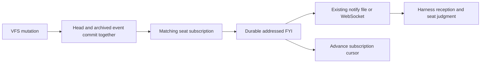

# VFS subscriptions and change triggers

A seat can subscribe to revisions of a plan, interface, draft or findings file.
The hub records the relationship, publishes addressed change notices, and uses the
existing inbox and harness listener. It does not run a model or watch local disks.

## Agent and HTTP operations

| Operation | MCP / Python client | HTTP |
| --- | --- | --- |
| Subscribe your seat | `fs_subscribe(channel, path, events=None, urgency="next_turn")` | `PUT /channels/{channel}/fs-subscriptions/{path}` |
| Inspect the audience | `fs_subscriptions(channel, path=None)` | `GET /channels/{channel}/fs-subscriptions?path=...` |
| Unsubscribe your seat | `fs_unsubscribe(channel, path)` | `DELETE /channels/{channel}/fs-subscriptions/{path}` |

Paths are exact normalized VFS paths, not globs or local filesystem paths. A file
need not exist yet. Event filters select `created`, `updated` and/or `deleted`;
the default includes all three. Recreation after deletion is `created`, with the
same path's monotonically increasing version. Deleting an absent file emits nothing.
The HTTP body rejects unknown fields; a caller cannot supply a different seat ID.

Subscriptions are durable and begin **after the current revision**, including a
tombstone. Repeating the identical request is idempotent and preserves pending
events. Changing filters or urgency replaces the subscription and begins at the
then-current revision; it does not replay prior events under the new policy.
There are at most 256 active subscriptions per seat.

## Awareness, urgency and work

Every subscription notice is an FYI. `inbox` is quiet; the default `next_turn`
qualifies for addressed attention; `interrupt` requests faster attention where the
harness supports it. An external driven Codex seat still receives between native
invocations. Subscription urgency is the recipient's explicit preference and grants
no operator-critical power. Other room members can read the notice, but it does not
wake important-only listeners that were not its addressee.

The notice carries the path, version, event, publishing seat, publication time and
an executable read pointer. `fs_write` and `fs_publish` accept an optional `summary`
(at most 500 characters), attributed to the author. It explains what changed or why;
the hub neither invents a summary nor treats it as verified evidence. Deletion
notices point to the previous live version and label it as such. Inspect current
head before editing, because later revisions may already exist.

Use the same mechanism for a shared findings, evidence or open-problems file.
Discussion and actionable questions remain ordinary authored messages citing the
exact artifact revision. The publisher can inspect `fs_subscriptions` to choose
relevant recipients, but must deliberately issue an addressed ask when a response
or work is required. A mutation never silently creates review obligations, accepts
content, or clears a claim's other dependencies. This is pub/sub for observable
revisions, not automatic classification of discoveries or correctness.

## Durability and boundaries

The revision archive stores event type and summary in the same transaction as the
file head. It is the source of events; a crash before the older FS audit message
does not lose subscription work. The normal write path attempts dispatch promptly;
the existing collection sweep retries pending revisions every 30 seconds by default,
with the dark sweep as a fallback. No additional background process is installed.
Closed/archived channels and paused hubs do not generate active subscription wakes.

A notice has a stable key for subscription identity and revision. Its cursor advances
only after durable ledger publication and notification attempt. A crash before that
advance retries the **same message**, so its notify line can repeat but the ledger
does not duplicate. A failed local notify-file write retains the cursor for retry.
Without local notify files, the durable inbox and ordinary WebSocket replay are the
delivery surfaces. This guarantees durable notices and recoverable notification
attempts, **not that an absent harness runs, reads, understands or acts**.

Registration requires channel membership. Delivery checks current membership;
leaving, retirement and channel archive remove subscriptions. No room access is
granted and nothing is forwarded into another room. Writers do not receive their
own changes through their subscriptions. Unsubscribing suppresses pending unpublished
notices; already-published notices and separate asks remain in the ledger. Cancellation
is available to the authenticated owner even after channel access is lost.
A dispatch already in flight when membership is removed may leave a notice in the
old room's ledger; notification fan-out checks the then-current room membership,
and the departed seat gains no access. Explicit unsubscribe is serialized with
subscription dispatch. Failed/closed recipients rotate fairly without advancing
their revision cursor, so they cannot starve other subscriptions.

The [collaboration graph](collaboration-graph.md) includes `subscribes_to` edges and
the event/urgency policy. Its revision cursor means published/attempted delivery or
skipped events, not a read receipt, accepted handoff or approval.

`waiting_for_artifacts` remains a separate exact VFS prerequisite. Use subscriptions
for ongoing awareness, that wait for a dependent revision, and addressed completion
replies for workspace handoffs. An attachment or local edit cannot masquerade as a
VFS event merely by sharing its filename.
